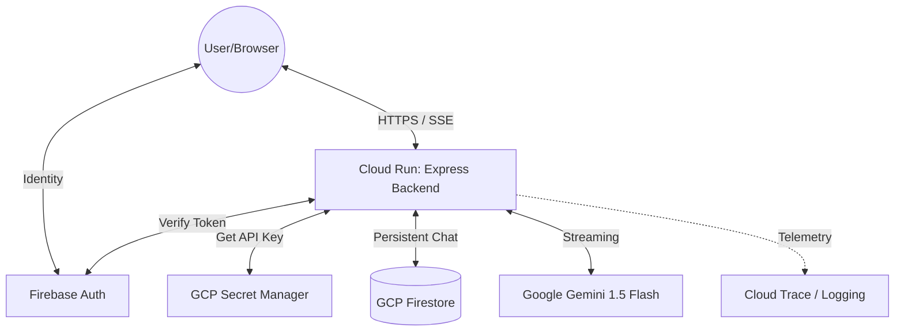

# 🗳️ CivicGuide: Enterprise AI Election Assistant

[](https://civicguide-india-619800545642.us-central1.run.app)
[](https://cloud.google.com)
[](https://firebase.google.com)

CivicGuide is a **FAANG-grade**, full-stack AI platform designed to educate users about the Indian Election process. This system is a showcase of modern cloud-native engineering, featuring secure multi-user sessions, persistent memory, and high-performance AI streaming.

---

## 🚀 Enterprise Features

- 🤖 **Real-time AI Streaming**: Sub-second latency responses powered by **Google Gemini 1.5 Flash** and Server-Sent Events (SSE).
- 🔐 **Identity Management**: Secure **Firebase Authentication** with Google Sign-In and persistence.
- 🧠 **Persistent Contextual Memory**: Multi-turn conversations stored in **Google Cloud Firestore** for seamless cross-device history.
- 🛡️ **Hardened Security**:
  - **Secret Manager**: Production API keys are stored in encrypted vaults, never in code or env vars.
  - **Per-User Rate Limiting**: Abuse prevention tied to authenticated Firebase UIDs.
  - **Hardened IAM**: Service-account level permissions for all cloud resource access.
- 📊 **Cloud Observability**:
  - **Google Cloud Trace**: End-to-end request tracing for performance monitoring.
  - **Cloud Logging**: Structured JSON logs for deep forensic analysis.
  - **Latency Tracking**: Real-time monitoring of AI and DB response times.

---

## 🏗️ System Design



---

## 🛠️ Technology Stack

- **Frontend**: React 19, Vite, Firebase SDK, Vanilla CSS (Glassmorphism)
- **Backend**: Node.js, Express, @google/generative-ai, @google-cloud/secret-manager
- **Infrastructure**: Google Cloud Platform (GCP), Docker, Firestore
- **Monitoring**: Google Cloud Trace, Cloud Logging, Morgan

---

## 🚦 Deployment

This project uses a fully automated CI/CD pipeline via **Google Cloud Build**.

```bash
# 1. Build & Push Image
gcloud builds submit --tag gcr.io/[PROJECT_ID]/civicguide-elite

# 2. Deploy with Secrets
gcloud run deploy civicguide-india \
  --image gcr.io/[PROJECT_ID]/civicguide-elite \
  --set-secrets="GEMINI_API_KEY=GEMINI_API_KEY:latest" \
  --set-env-vars="NODE_ENV=production"
```

---

*Engineered for Civic Awareness at Scale.*
